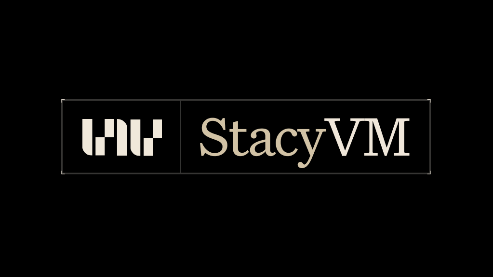
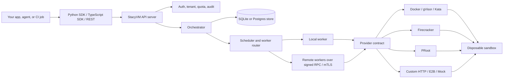

<p align="center">
  
</p>

<h3 align="center"><b>Your AI agent just got its own computer.</b></h3>

<p align="center">
Self-hosted execution infrastructure for AI agents, code runners, previews, and automation workflows.
</p>

<p align="center">
One tool. Every isolation level. Every platform.<br><br>
On a Mac? Start with the Docker provider, no KVM needed.<br>
On bare metal? Use certified Firecracker snapshot hosts for microVM speed.<br>
On Kubernetes? gVisor or Kata containers.<br>
Need 100 sandboxes but only have 20 VMs? Pool mode.<br>
Need to expose <code>localhost:3000</code> from inside the sandbox? Live preview, one method call. (Port 3000 today; configurable ports tracked on the roadmap.)<br><br>
Self-hosted. Single binary. Python &amp; TypeScript SDKs. Apache 2.0 licensed. No cloud required.
</p>

<p align="center">
  <a href="https://github.com/StacyOS/stacyvm/stargazers"></a>
  <a href="https://github.com/StacyOS/stacyvm/network/members"></a>
  <a href="https://github.com/StacyOS/stacyvm/issues"></a>
  
  
  
</p>

<p align="center">
  <a href="#quick-start">Quick Start</a> •
  <a href="docs/getting-started/developer-onboarding.mdx">Developer Onboarding</a> •
  <a href="#why-stacyvm">Why StacyVM</a> •
  <a href="#pick-your-isolation-level">Providers</a> •
  <a href="#live-preview">Live Preview</a> •
  <a href="#pool-mode">Pool Mode</a> •
  <a href="docs/deployment.md">Deployment</a> •
  <a href="docs/rest-api.md">API Reference</a> •
  <a href="CONTRIBUTING.md">Contributing</a>
</p>

---

## Table of contents

- [Table of contents](#table-of-contents)
- [Quick start](#quick-start)
- [Clean verification flow](#clean-verification-flow)
- [Why StacyVM?](#why-stacyvm)
  - [The math](#the-math)
- [Pick your isolation level](#pick-your-isolation-level)
- [Live Preview](#live-preview)
- [Pool mode — the feature nobody else has](#pool-mode--the-feature-nobody-else-has)
- [SDKs](#sdks)
- [REST API](#rest-api)
  - [Sandboxes](#sandboxes)
  - [Files (per sandbox)](#files-per-sandbox)
  - [Templates](#templates)
  - [Providers, pool, system](#providers-pool-system)
- [CLI](#cli)
- [Configuration](#configuration)
- [Enterprise / Multi-worker](#enterprise--multi-worker)
  - [OIDC & RBAC](#oidc--rbac)
  - [Multi-tenancy & policy controls](#multi-tenancy--policy-controls)
  - [Remote workers & mTLS](#remote-workers--mtls)
- [Production deployment](#production-deployment)
- [Templates](#templates-1)
- [Security defaults](#security-defaults)
- [Architecture](#architecture)
- [Web Dashboard](#web-dashboard)
- [Install options](#install-options)
- [Project layout](#project-layout)
- [Roadmap](#roadmap)
- [Contributing](#contributing)
- [License](#license)

---

## Quick start

```bash
npx stacyvm-setup@latest
```

That command clones StacyVM if needed, installs package dependencies, downloads Go modules, builds the binary, and starts the server at `http://localhost:7423`.

You still need:

- Node.js 18+ and npm for the bootstrap command.
- Go when building from source.
- Docker Desktop or Docker Engine running for the default local Docker provider.

Then verify the server:

```bash
curl http://localhost:7423/api/v1/live
curl http://localhost:7423/api/v1/ready
```

Create a sandbox:

```bash
curl -sS -X POST http://localhost:7423/api/v1/sandboxes \
  -H "Content-Type: application/json" \
  -d '{"image":"python:3.12","ttl":"10m"}'
```

Copy the returned sandbox ID, then run code and destroy it:

```bash
export SANDBOX_ID="PASTE_ID_HERE"

curl -sS -X POST "http://localhost:7423/api/v1/sandboxes/${SANDBOX_ID}/exec" \
  -H "Content-Type: application/json" \
  -d '{"command":"python3 -c \"print(40 + 2)\"","timeout":"10s"}'

curl -sS -X DELETE "http://localhost:7423/api/v1/sandboxes/${SANDBOX_ID}"
```

Expected exec output includes:

```json
"stdout": "42\n"
```

Install an SDK when you are ready to build:

```bash
pip install stacyvm
npm install stacyvm
```

Python:

```python
from stacyvm import Client

client = Client("http://localhost:7423")
sandbox = client.spawn(image="python:3.12")

result = sandbox.exec('python3 -c "print(40 + 2)"')
print(result.stdout)  # 42

sandbox.destroy()
```

TypeScript:

```typescript
import { Client } from "stacyvm";

const client = new Client("http://localhost:7423");
const sandbox = await client.spawn({ image: "node:20" });

const result = await sandbox.exec("node -e \"console.log(40 + 2)\"");
console.log(result.stdout); // 42

await sandbox.destroy();
```

For the complete copy-paste local setup, see [Developer Onboarding](docs/getting-started/developer-onboarding.mdx).

---

## Clean verification flow

Use this when you want to check clone, dependency install, Go module download, and build behavior before starting the server.

```bash
npm view stacyvm-setup name version bin --json
npx stacyvm-setup@latest --help
```

```bash
mkdir -p /tmp/stacyvm-npx-test
cd /tmp/stacyvm-npx-test

npx stacyvm-setup@latest \
  --dir ./stacyvm \
  --no-start
```

Expected result:

```bash
./stacyvm/stacyvm
```

Start StacyVM:

```bash
cd /tmp/stacyvm-npx-test/stacyvm
./stacyvm serve
```

Leave that terminal running, then use the health and sandbox checks from the quick start in a second terminal.

---

## Why StacyVM?

You're building an AI agent. It generates code. That code needs to run somewhere safe.

**The problem:**

- **Docker** shares the host kernel. One container escape and your machine is owned. Multiple [runc CVEs in 2024-2025](https://github.com/opencontainers/runc/security/advisories) proved this isn't theoretical.
- **Cloud sandboxes** (E2B, Modal) send your code and data to someone else's servers. Adds latency, costs money, and you lose control of your data.
- **Daytona** is self-hostable but needs [12 services](https://www.daytona.io/docs/en/oss-deployment) (PostgreSQL, Redis, MinIO, Dex, registry...) just to get started.
- **Zeroboot** is blazing fast (~0.8ms) but strips everything — no networking, no filesystem, no multi-vCPU, serial-only I/O. Built for "run a function, get a result."

**StacyVM is one binary.** Self-hosted. Your data never leaves your machine. And you choose the isolation level — Docker containers for dev, gVisor for cloud VMs, Firecracker microVMs for maximum hardware-level security, and certified snapshot restores for low-latency production hosts.

| | StacyVM | E2B | Zeroboot | Daytona | Modal | Raw Docker |
|---|:---:|:---:|:---:|:---:|:---:|:---:|
| Self-hosted | ✅ | ❌ Cloud only | ✅ | ✅ (12 services) | ❌ Cloud only | ✅ |
| Isolation | KVM + gVisor + Docker | Container | KVM only | Container | Container | Shared kernel |
| Cold boot | Docker locally; Firecracker snapshots on certified Linux/KVM hosts | ~500ms | **~0.8ms** (CoW fork) | Seconds | Seconds | ~200ms |
| Networking | ✅ | ✅ | ❌ Serial only | ✅ | ✅ | ✅ |
| Filesystem / disk I/O | ✅ | ✅ | ❌ Memory only | ✅ | ✅ | ✅ |
| Multi-vCPU | ✅ | ✅ | ❌ Single vCPU | ✅ | ✅ | ✅ |
| Multiple providers | ✅ KVM/Docker/gVisor | ❌ | ❌ KVM only | ❌ | ❌ | N/A |
| Runs without KVM | ✅ Docker provider | N/A | ❌ | ✅ | N/A | ✅ |
| Multi-user pool mode | ✅ | ❌ | ❌ | ❌ | ❌ | ❌ |
| Live preview URLs | ✅ Built-in (Traefik, port 3000) | ✅ | ❌ | Partial | ✅ | ❌ |
| File API (read/write/glob) | ✅ 8 file methods + exec | ✅ | ❌ | ❌ | ❌ | ❌ |
| Python + TS SDKs | ✅ | ✅ | ✅ | ❌ | ✅ | ❌ |
| Your data stays local | ✅ | ❌ | ✅ | ✅ | ❌ | ✅ |
| License | Apache 2.0 | Partial | Apache 2.0 | Apache 2.0 | Proprietary | N/A |

> **On speed:** Zeroboot's 0.8ms is real — they bypass Firecracker's VMM entirely and `mmap(MAP_PRIVATE)` the snapshot memory as copy-on-write. But there's no disk, no network, and I/O is serial UART only. StacyVM focuses on full disposable sandboxes with networking, filesystem access, provider choice, and runtime certification.

### The math

E2B charges per second. Default sandbox = 2 vCPU + 512 MiB RAM:

```
2 vCPU:    $0.000028/s
512 MiB:   $0.0000045/GiB/s × 0.5 GiB = $0.00000225/s
─────────────────────────────────────────
Total:     $0.00003025/s = $0.109/hour per sandbox
```

| Concurrent sandboxes | E2B / month | StacyVM pool mode |
|---|---|---|
| 10 | $261 compute + $150 plan = **$411** | **$0** |
| 50 | $1,307 compute + $150 plan = **$1,457** | **$0** |
| 100 | $2,614 compute + $150 plan = **$2,764** | **$0** |

_Assumes 8h/day active. StacyVM pool mode: 5 users per VM, your own infra._

---

## Pick your isolation level

StacyVM has a **provider interface**. One config change swaps the entire backend. Your application code doesn't change.

```yaml
# stacyvm.yaml — change one line
providers:
  default: "docker"  # or "firecracker", "e2b", "custom", "proot", "mock"
  docker:
    runtime: "runc"  # or "runsc" (gVisor) or "kata-runtime"
```

| Provider | What it does | KVM? | Boot | Use when |
|---|---|:---:|---|---|
| **Firecracker** | Real microVM. Own kernel, rootfs, network. Fast snapshot restores on certified Linux/KVM hosts. | Yes | Snapshot restore | Production. Maximum isolation. |
| **Docker** (runc) | OCI container with seccomp, cap_drop ALL, read-only rootfs option. | No | ~200ms | Dev, CI/CD, Mac, Windows. |
| **Docker** (gVisor) | Same as above, but syscalls hit a user-space kernel instead of host. | No | ~400ms | Cloud VMs. Stronger than containers. |
| **Docker** (Kata) | Lightweight VM per container. Hardware isolation without Firecracker setup. | Yes | ~1s | Kubernetes (AKS/GKE). |
| **E2B** | Forwards to E2B's hosted SaaS. Useful for hybrid deployments. | N/A | ~500ms | Bursting to cloud. |
| **Custom** | Pluggable HTTP backend. Bring your own runtime. | N/A | Varies | Special infra (HPC, Nomad, etc.). |
| **PRoot** | User-space chroot. No root, no KVM, no Docker. | No | Instant | Restricted hosts (Android, shared servers). |
| **Mock** | Temp directories on the host. Zero overhead. | No | Instant | Testing, development. |

Every provider implements the same interface. SDKs, REST API, CLI, pool mode, live preview — all work identically regardless of backend.

---

## Live Preview

Sandboxes can serve HTTP on port 3000 and StacyVM gives you a public URL for it — no manual port forwarding, no SSH tunnels. Configurable ports per sandbox are on the roadmap; today the Docker provider routes port 3000 by convention.

```python
from stacyvm import Client

client = Client("http://localhost:7423")
sandbox = client.spawn(image="node:20")

sandbox.write_file("/app/server.js", "require('http').createServer((req,res)=>res.end('hi')).listen(3000)")
sandbox.exec("node /app/server.js &")

print(sandbox.get_preview_url(3000))
# http://3000-sb-a1b2c3d4.localhost
```

```typescript
const sb = await client.spawn({ image: "node:20" });
await sb.writeFile("/app/index.js", code);
sb.exec("node /app/index.js &");

console.log(sb.getPreviewUrl(3000));
// http://3000-sb-a1b2c3d4.localhost
```

**How it works.** A bundled Traefik instance watches Docker labels. When you spawn a sandbox, StacyVM injects routing labels (`Host(\`3000-{id}.{domain}\`)`). Traefik picks them up instantly — no restarts, no config files. Open the URL in a browser, Traefik forwards the request to the sandbox's container.

**Local development:**
```yaml
# stacyvm.yaml
server:
  preview_domain: "localhost"   # browsers resolve *.localhost to 127.0.0.1
```
```bash
docker compose up -d
# visit http://3000-sb-xyz.localhost
```

**Production:**
```yaml
server:
  preview_domain: "stacyide.xyz"
```
Point a wildcard DNS record (`*.stacyide.xyz` → your server IP), give Traefik ports 80/443, and add an ACME resolver for Let's Encrypt. Users get HTTPS preview URLs automatically.

Full architecture write-up: [docs/live-preview-architecture.md](docs/live-preview-architecture.md).

> Live preview today: Docker provider, port 3000 only. Configurable ports and Firecracker support are tracked on the roadmap.

---

## Pool mode — the feature nobody else has

Traditional sandbox tools: 1 user = 1 VM. 100 users = 100 VMs = massive bill.

StacyVM pool mode: **1 VM serves N users.** Each gets an isolated `/workspace/{id}/`. Path traversal blocked. Optional per-user UID + PID namespace hardening.

```yaml
pool:
  enabled: true
  max_vms: 20
  max_users_per_vm: 5
  image: "python:3.12-slim"
  memory_mb: 2048
  vcpus: 2
  overflow: "reject"   # or "queue"
```

Identify users with the `X-User-ID` header on every request:

```python
client = Client("http://localhost:7423", user_id="alice@example.com")
```
```typescript
const client = new Client({ baseUrl: "http://localhost:7423", userId: "alice@example.com" });
```

User IDs are trimmed by the server. They must be 128 characters or fewer and cannot contain whitespace, control characters, or path separators.

**Pool isolation today.** Each user gets their own workspace under `/workspace/{user_id}/`. Path traversal is rejected by the file API. The shared container runs as a non-root user, with `cap_drop: ALL`, the default seccomp profile, and a PID limit.

> **Coming in v0.2:** per-user UIDs, per-user PID namespaces, `/proc` hardening (`hidepid`), and stricter workspace permissions. Config knobs for these (`per_user_uid`, `pid_namespace`, `workspace_permissions`, `hidepid`) exist in the schema but are **not yet wired up in the Docker provider** — setting them has no effect today. Don't rely on them for multi-tenant isolation until v0.2. Tracked in the roadmap.

**100 users → 20 VMs instead of 100. 60% less infrastructure** at the cost of softer isolation than 1:1 (shared kernel and PID namespace within each VM until v0.2 ships the hardening knobs above). For workloads where users trust each other (single org, internal CI, AI agents owned by the same account), the tradeoff is usually a clear win. For untrusted multi-tenant, stick with 1:1 until v0.2.

Pool mode is implemented above the provider contract, so user assignment, workspace scoping, and cleanup stay consistent across supported runtimes.

Check pool status from the SDK:
```python
print(client.pool_status())
# {"enabled": true, "vms": 3, "max_vms": 20, "total_users": 14, "max_users_per_vm": 5}
```

---

## SDKs

Both SDKs are thin wrappers over the REST API. Same method names, same return shapes (translated to native conventions per language).

<table>
<tr>
<td width="50%"><b>Python</b></td>
<td width="50%"><b>TypeScript</b></td>
</tr>
<tr>
<td>

```python
from stacyvm import Client

client = Client("http://localhost:7423")

# Context manager — auto-destroys on exit
with client.spawn(image="python:3.12") as sb:
    sb.exec("pip install pandas")
    sb.write_file("/app/analyze.py", code)
    result = sb.exec("python3 /app/analyze.py")
    print(result.stdout)

# Stream output
for chunk in sb.exec_stream("npm test"):
    print(chunk.data, end="")

# Async support
from stacyvm import AsyncClient
async with AsyncClient("http://localhost:7423") as client:
    sb = await client.spawn()
    result = await sb.exec("whoami")
    await sb.destroy()
```

</td>
<td>

```typescript
import { Client } from "stacyvm";

const client = new Client("http://localhost:7423");
const sb = await client.spawn({ image: "node:20" });

// Files + exec
await sb.writeFile("/app/index.js", code);
const result = await sb.exec("node /app/index.js");
console.log(result.stdout);

// Stream output in real-time
for await (const chunk of sb.execStream("npm test")) {
  process.stdout.write(chunk.data);
}

// Auto-destroy with withSandbox()
await client.withSandbox({ image: "node:20" }, async (sb) => {
  await sb.exec("npm test");
});

await sb.destroy();
```

</td>
</tr>
</table>

```bash
pip install stacyvm    # Python
npm install stacyvm    # TypeScript
```

Full SDK references:
- **Python:** [sdk/python/README.md](sdk/python/README.md)
- **TypeScript:** [sdk/js/README.md](sdk/js/README.md)

---

## REST API

Base URL: `http://localhost:7423/api/v1`

Auth: pass `X-API-Key: <your-key>` if `auth.enabled: true`. For pool mode, also send `X-User-ID: <user-id>`.

### Sandboxes

| Method | Endpoint | Description |
|---|---|---|
| `POST` | `/sandboxes` | Spawn a sandbox |
| `POST` | `/sandboxes/admission` | Preflight quota and scheduler admission |
| `GET` | `/sandboxes` | List active sandboxes |
| `DELETE` | `/sandboxes` | Prune expired sandboxes |
| `GET` | `/sandboxes/{id}` | Get sandbox details |
| `DELETE` | `/sandboxes/{id}` | Destroy sandbox |
| `POST` | `/sandboxes/{id}/extend` | Extend TTL |
| `POST` | `/sandboxes/{id}/exec` | Execute a command (sync or NDJSON stream) |
| `GET` | `/sandboxes/{id}/exec/ws` | Execute over WebSocket |
| `GET` | `/sandboxes/{id}/logs` | Console logs |

Exec requests default to backwards-compatible shell mode. Set `mode: "argv"` with `args` to run direct process arguments without shell interpolation.

### Files (per sandbox)

| Method | Endpoint | Description |
|---|---|---|
| `POST` | `/sandboxes/{id}/files` | Write a file |
| `GET` | `/sandboxes/{id}/files?path=` | Read a file |
| `DELETE` | `/sandboxes/{id}/files?path=` | Delete a file (`recursive=true` for dirs) |
| `GET` | `/sandboxes/{id}/files/list?path=` | List a directory |
| `POST` | `/sandboxes/{id}/files/move` | Move/rename (body: `old_path`, `new_path`) |
| `POST` | `/sandboxes/{id}/files/chmod` | Change permissions |
| `GET` | `/sandboxes/{id}/files/stat?path=` | File metadata |
| `GET` | `/sandboxes/{id}/files/glob?pattern=` | Glob pattern matching |

### Templates

| Method | Endpoint | Description |
|---|---|---|
| `POST` | `/templates` | Create a template |
| `GET` | `/templates` | List templates |
| `GET` | `/templates/{name}` | Get a template |
| `PUT` | `/templates/{name}` | Update a template |
| `DELETE` | `/templates/{name}` | Delete a template |
| `POST` | `/templates/{name}/spawn` | Spawn a sandbox from a template |

### Providers, pool, system

| Method | Endpoint | Description |
|---|---|---|
| `GET` | `/providers` | List configured providers |
| `GET` | `/providers/{name}` | Provider details + sandbox count |
| `POST` | `/providers/test` | Health-check all providers |
| `GET` | `/quotas` | List owner quota overrides |
| `GET` | `/quotas/summary` | Redacted owner quota policy counts |
| `PUT` | `/quotas/{ownerID}` | Create or update owner quota |
| `GET` | `/quotas/{ownerID}/usage` | Owner usage against effective quota |
| `GET` | `/workers` | List registered workers and heartbeat state |
| `GET` | `/workers/{workerID}` | Get one worker registry record |
| `POST` | `/worker/{workerID}/heartbeat` | Remote worker heartbeat with worker token |
| `POST` | `/worker/{workerID}/leases/{resourceID}/renew` | Remote worker lease renewal |
| `GET` | `/pool/status` | Pool VM and user counts |
| `GET` | `/snapshots` | Available VM snapshots |
| `GET` | `/health` | Health check |
| `GET` | `/ready` | Readiness check |
| `GET` | `/diagnostics` | Redacted operational diagnostics |
| `GET` | `/metrics` | Runtime metrics (goroutines, alloc, sandbox counts) |
| `GET` | `/metrics/prometheus` | Prometheus-compatible metrics |
| `GET` | `/events` | Server-sent events stream |

Admin aliases for providers, quotas, workers, diagnostics, and metrics are available under `/admin/*` and can be protected with `auth.admin_api_key`. Worker registry deletion remains admin-only under `/admin/workers/*`; remote worker heartbeat and lease renewal use worker-only `/worker/*` endpoints.
For the operator dashboard, quota workflows, diagnostics, and persisted admin audit history, see [docs/admin-control-plane.md](docs/admin-control-plane.md).

Full schemas, request/response examples, and error codes: **[docs/rest-api.md](docs/rest-api.md)**.
OpenAPI spec: [docs/swagger.yaml](docs/swagger.yaml).

---

## CLI

```bash
stacyvm serve                                  # start the API server
stacyvm worker --once                          # send one remote-worker heartbeat
stacyvm worker --listen 127.0.0.1:7430         # heartbeat + worker RPC server
stacyvm spawn --image python:3.12 --ttl 1h     # spawn
stacyvm exec sb-a1b2c3d4 -- python3 app.py     # run argv mode in a sandbox
stacyvm exec sb-a1b2c3d4 --shell -- "echo $HOME && pwd"
stacyvm list                                    # list active sandboxes
stacyvm kill sb-a1b2c3d4                        # destroy
stacyvm build-image python:3.12                 # pre-build rootfs (Firecracker)
stacyvm config lint --production                # production config lint gate
stacyvm db backup /backup/stacyvm.db            # consistent SQLite backup
stacyvm upgrade rehearse --database stacyvm.db  # rehearse single-node upgrade
stacyvm support bundle support.json             # redacted support diagnostics
stacyvm tui                                     # interactive dashboard
stacyvm version                                 # version info
```

Global flags:
- `--server` — server URL (default `http://localhost:7423`)
- `--api-key` — API key (or `STACYVM_API_KEY` env var)

---

## Configuration

```yaml
# stacyvm.yaml — sane defaults work without it
server:
  host: "0.0.0.0"
  port: 7423
  preview_domain: "localhost"   # used to build live-preview URLs
  cors_allowed_origins: ["*"]    # set explicit https:// origins in production

worker:
  id: ""                         # defaults to hostname
  control_plane_url: "http://localhost:7423"
  listen_addr: ""                 # set to enable inbound worker RPC
  heartbeat_interval: "30s"
  shutdown_timeout: "10s"
  rpc_tls:
    enabled: false
    server_cert_file: ""
    server_key_file: ""
    client_ca_file: ""
    ca_file: ""
    client_cert_file: ""
    client_key_file: ""
    server_name: ""
    insecure_skip_verify: false

providers:
  default: "docker"

  docker:
    enabled: true
    socket: "unix:///var/run/docker.sock"
    runtime: "runc"             # or "runsc" (gVisor), "kata-runtime"
    network_mode: "bridge"
    read_only_rootfs: false
    seccomp_profile: "default"
    dropped_caps: ["ALL"]
    added_caps: []
    pids_limit: 256
    # pool_security knobs (per_user_uid, pid_namespace, workspace_permissions,
    # hidepid) are reserved for v0.2 and have no effect today.

  firecracker:
    enabled: true
    firecracker_path: "/usr/local/bin/firecracker"
    kernel_path: "/var/lib/stacyvm/vmlinux.bin"
    agent_path: "./bin/stacyvm-agent"
    data_dir: "/var/lib/stacyvm"

  e2b:
    enabled: false
    api_key: ""
    base_url: "https://api.e2b.dev"

  custom:
    enabled: false
    base_url: ""
    api_key: ""

  proot:
    enabled: false
    rootfs_path: "/var/lib/stacyvm/rootfs"

defaults:
  ttl: "30m"
  image: "alpine:latest"
  memory_mb: 1024
  vcpus: 1
  max_ttl: "24h"
  default_exec_timeout: "0s"    # disabled unless set
  max_exec_timeout: "10m"
  max_sandboxes: 0              # 0 = unlimited
  max_sandboxes_per_owner: 0    # 0 = unlimited
  spawn_overflow: "reject"       # reject or queue when sandbox capacity is full
  spawn_queue_timeout: "30s"
  max_spawn_queue: 100

auth:
  enabled: false
  api_key: ""
  admin_api_key: ""             # optional separate key for /api/v1/admin/*
  worker_token: ""               # shared staging worker token
  worker_token_file: ""          # file containing shared worker token
  worker_tokens: {}              # production map of worker_id: token
  worker_signing_key: ""         # production signed worker token verification key
  worker_signing_key_file: ""    # file containing active worker signing key
  worker_signing_keys: []        # old verification keys accepted during rotation
  worker_revoked_token_ids: []   # signed worker token jti values rejected during incidents
  admin_fallback_enabled: true   # false requires admin_api_key for admin routes
  admin_audit_retention: "0s"    # 0s disables native audit pruning

  # OIDC/SSO — enterprise single sign-on (RS256 and ES256/ES384/ES512)
  oidc_enabled: false
  oidc_issuer: ""                # e.g. https://accounts.google.com
  oidc_audience: ""              # your application's client ID / audience
  oidc_jwks_url: ""              # IdP's JWKS endpoint for key verification
  oidc_public_key_file: ""       # alternative: static PEM public key file
  oidc_groups_claim: "groups"    # JWT claim containing group memberships
  oidc_tenant_claim: "tenant_id" # JWT claim containing tenant identifier
  oidc_admin_groups: []          # groups that receive the admin role
  oidc_operator_groups: []       # groups that receive the operator role
  oidc_viewer_groups: []         # groups that receive the read-only viewer role

rate_limit:
  enabled: false
  requests_per_minute: 120
  burst: 60
  key_by: "owner"        # owner, api_key, or ip
  bucket_ttl: "15m"
  cleanup_interval: "1m"

database:
  driver: "sqlite"        # sqlite; postgres config is reserved for cluster builds
  path: "stacyvm.db"
  dsn: ""                 # required for future postgres-backed cluster mode

logging:
  level: "info"           # debug | info | warn | error
  format: "json"          # or "pretty"

pool:
  enabled: false
  max_vms: 10
  max_users_per_vm: 5
  image: "alpine:latest"
  memory_mb: 2048
  vcpus: 2
  overflow: "reject"      # or "queue"
```

**Config priority:** `./stacyvm.yaml` → `~/.stacyvm/config.yaml` → environment variables.

**Env vars:** prefix `STACYVM_`, dots become underscores. Examples:
```bash
STACYVM_SERVER_PORT=8080
STACYVM_PROVIDERS_DEFAULT=firecracker
STACYVM_AUTH_API_KEY=sk-xyz123
STACYVM_AUTH_ADMIN_API_KEY=sk-admin-xyz123
STACYVM_AUTH_ADMIN_FALLBACK_ENABLED=false
STACYVM_RATE_LIMIT_ENABLED=true
STACYVM_LOGGING_LEVEL=debug
```

---

## Enterprise / Multi-worker

StacyVM ships everything you need to run as multi-tenant infrastructure. All features below are stable and covered by CI.

### OIDC & RBAC

Enable enterprise SSO by pointing StacyVM at any RFC 7517-compliant identity provider:

```yaml
auth:
  enabled: true
  oidc_enabled: true
  oidc_issuer: "https://accounts.google.com"      # or Okta, Cloudflare, Azure AD
  oidc_audience: "my-stacyvm"
  oidc_jwks_url: "https://www.googleapis.com/oauth2/v3/certs"
  oidc_admin_groups: ["stacyvm-admins"]
  oidc_operator_groups: ["stacyvm-operators"]
  oidc_viewer_groups: ["stacyvm-viewers"]
```

Callers send a standard Bearer token. StacyVM validates it (RS256 and ES256/ES384/ES512 are both supported) and maps IdP group membership to one of four roles:

| Role | Can do |
|---|---|
| `viewer` | List and inspect sandboxes |
| `api` / `operator` | Spawn, exec, read/write files, destroy |
| `admin` | Everything + quotas, workers, provider config, tenants |
| `tenant_admin` | Admin within their own tenant |

Scope enforcement is applied on every route when auth is configured. A viewer token cannot spawn or exec — it gets 403.

Run `stacyvm config lint --production` to validate your OIDC config before exposing it.

### Multi-tenancy & policy controls

Create isolated tenants and restrict what each one can use:

```bash
# Create a tenant
curl -X POST /api/v1/admin/tenants \
  -d '{"id":"acme","name":"Acme Corp","owner_id":"user-alice"}'

# Add a member with operator role
curl -X PUT /api/v1/admin/tenants/acme/members/user-bob \
  -d '{"role":"operator"}'

# Allow only trusted images
curl -X POST /api/v1/admin/tenants/acme/policies \
  -d '{"resource_type":"image","effect":"allow","pattern":"alpine:*","priority":10}'

# Block untrusted networks
curl -X POST /api/v1/admin/tenants/acme/policies \
  -d '{"resource_type":"network","effect":"deny","pattern":"host","priority":1}'

# Export per-tenant audit log
curl /api/v1/admin/tenants/acme/audit
```

Each tenant's sandboxes, audit logs, and policies are fully isolated. OIDC callers are automatically scoped to their tenant via the configurable `oidc_tenant_claim`.

### Remote workers & mTLS

Run a distributed cluster with signed worker tokens and mutual TLS on the RPC channel:

```yaml
# Control plane
auth:
  worker_signing_key: "<32-byte secret>"
worker:
  rpc_tls:
    enabled: true
    ca_file: /etc/stacyvm/ca.crt
    client_cert_file: /etc/stacyvm/cp-client.crt
    client_key_file: /etc/stacyvm/cp-client.key
```

```bash
# Worker — receives short-lived signed tokens from the control plane issuer
# (no direct access to the signing key needed)
stacyvm worker \
  --control-plane https://cp.internal:7423 \
  --bootstrap-admin-key "$STACYVM_ADMIN_KEY" \
  --bootstrap-token-ttl 5m \
  --listen 0.0.0.0:7430
```

Key rotation, token revocation, mTLS cert management, and the full enterprise signoff checklist are documented in [docs/enterprise-signoff-runbook.md](docs/enterprise-signoff-runbook.md).

---

## Production deployment

Use [docs/deployment.md](docs/deployment.md) for production setup guidance, including Docker Compose and systemd templates, auth, explicit CORS origins, rate-limit defaults, health/readiness probes, Prometheus scraping, backup steps, and provider-specific rollout notes. Remote worker staging guidance lives in [docs/remote-worker-staging.md](docs/remote-worker-staging.md). Runtime signoff expectations live in [docs/runtime-conformance.md](docs/runtime-conformance.md), public self-serve support expectations live in [docs/public-support-matrix.md](docs/public-support-matrix.md), public announcement evidence lives in [docs/public-readiness-evidence.md](docs/public-readiness-evidence.md), and release-candidate gates live in [docs/production-readiness.md](docs/production-readiness.md). The reusable templates live under [`deploy/`](deploy/).

For enterprise multi-worker deployments, follow [docs/enterprise-signoff-runbook.md](docs/enterprise-signoff-runbook.md) — it covers mTLS smoke with deployment-issued certificates, per-host runtime certification, Postgres migration rehearsal, OIDC token validation, and the full pre-go-live checklist.

Run `stacyvm doctor --production` on a target host before treating it as production-ready. Runtime host certification checks live in [docs/runtime-certification.md](docs/runtime-certification.md).

Release automation and GHCR publishing are documented in [docs/releasing.md](docs/releasing.md).

---

## Templates

Templates are pre-baked sandbox specs stored server-side. Define once, spawn many times.

```bash
curl -X POST http://localhost:7423/api/v1/templates \
  -H 'Content-Type: application/json' \
  -d '{
    "name": "python-dev",
    "image": "python:3.12-slim",
    "memory_mb": 1024,
    "vcpus": 2,
    "ttl": "1h"
  }'
```

```python
sandbox = client.spawn(template="python-dev")           # spawn from template
client.templates.list()                                  # list all
client.templates.delete("python-dev")                    # delete
```

```typescript
const sb = await client.templates.spawn("python-dev");
const all = await client.templates.list();
await client.templates.delete("python-dev");
```

---

## Security defaults

Every sandbox ships locked down. You opt *in* to less restriction, not out.

| Layer | Default | What it does |
|---|---|---|
| Capabilities | `cap_drop: ALL` | Can't mount, ptrace, load modules, change networking |
| Syscalls | Seccomp default profile | Blocks ~44 dangerous syscalls |
| Filesystem | Read-only rootfs (Firecracker), opt-in (Docker) | Only `/tmp` and `/workspace` writable on Firecracker |
| Network | Bridge by default; `none` available | Switch to `network_mode: none` to block outbound |
| Processes | PID limit: 256 | Fork bombs die immediately |
| User | Non-root | No root inside the sandbox |
| Lifetime | TTL auto-expiry | Forgotten sandboxes clean themselves up |

With the Firecracker provider you also get: dedicated kernel per sandbox, vsock-only host-guest communication (no TCP between host and guest), and ephemeral rootfs destroyed on teardown.

For enterprise deployments, OIDC/JWT authentication (RS256 + ES256) and RBAC role enforcement replace static API keys. Scope checks are applied on every sandbox route — a viewer-role token cannot spawn or exec. See the [Enterprise / Multi-worker](#enterprise--multi-worker) section above.

Full security model and reporting policy: [SECURITY.md](SECURITY.md). Production admin hardening and identity-provider planning: [docs/security-governance.md](docs/security-governance.md). Release-candidate threat model: [docs/threat-model.md](docs/threat-model.md). Worker RPC and multi-worker trust boundary: [docs/worker-rpc-contract.md](docs/worker-rpc-contract.md).

---

## Architecture



**Request flow:** SDK → REST API → Orchestrator (lifecycle, TTL, pool, templates) → Provider → Sandbox.

**Live preview flow:** Browser → Traefik → Docker label lookup → Sandbox container.

**Snapshot trick:** On certified Linux/KVM hosts, Firecracker can cold-boot once, snapshot VM state, then restore from that snapshot for fast sandbox startup. Details in [docs/snapshot-restore.md](docs/snapshot-restore.md) and [docs/runtime-certification.md](docs/runtime-certification.md).

Full architecture guide: [docs/architecture/system-overview.mdx](docs/architecture/system-overview.mdx).

---

## Web Dashboard

Built-in React dashboard for sandbox management, live terminal, file browser, and log viewer. Lives at `web/`.

```bash
make web                     # build the frontend (web/dist)
./stacyvm serve              # serves the dashboard at http://localhost:7423
```

The dashboard talks to the same REST API documented above — useful as a working reference.

---

## Install options

**One-command setup (recommended for individual developers):**
```bash
npx stacyvm-setup@latest
```

**Desktop app (download & run — no terminal needed):**

Prebuilt installers for Linux, macOS, and Windows are attached to each
[release](https://github.com/StacyOS/stacyvm/releases/latest):

- **Windows** — `StacyVM-amd64-installer.exe`
- **macOS** — `StacyVM-macos-universal.dmg` (universal — Apple Silicon + Intel)
- **Linux** — `StacyVM-x86_64.AppImage`

The desktop app bundles the dashboard and the API daemon in a single window; you
still need **Docker** running to spawn sandboxes. Full guide:
[docs/desktop-app.md](docs/desktop-app.md). Builds are currently unsigned, so
macOS/Windows show a one-time "unidentified developer" prompt on first launch.

**Existing source checkout:**
```bash
git clone https://github.com/StacyOS/stacyvm.git
cd stacyvm
make dev
```

**Production-oriented Docker Compose:**
```bash
cd deploy
cp .env.example .env
docker compose up -d
docker compose logs -f stacyvm
```

**Docker (StacyVM only):**
```bash
docker build -t stacyvm .
docker run -p 7423:7423 stacyvm
```

**Release binary:**
```bash
curl -L -o stacyvm.tar.gz \
  https://github.com/StacyOS/stacyvm/releases/latest/download/stacyvm_linux_amd64.tar.gz
tar -xzf stacyvm.tar.gz
sudo install -m 0755 stacyvm /usr/local/bin/stacyvm
```

For public installs, verify the release first:

```bash
scripts/post-release-validate.sh v0.15.0
```

Replace `v0.15.0` with the release tag you plan to deploy. The installer verifies Sigstore signatures automatically when `cosign` is installed. Set `STACYVM_REQUIRE_SIGNATURES=true` to fail closed when signature verification is unavailable.

---

## Project layout

```
stacyvm/
├── cmd/                 # CLI entrypoints (stacyvm, stacyvm-agent)
├── internal/            # Server, orchestrator, providers, API handlers
│   ├── api/             # HTTP handlers (chi router)
│   ├── orchestrator/    # Lifecycle, TTL, templates, pool, event bus
│   ├── providers/       # docker, firecracker, e2b, custom, proot, mock
│   └── config/          # Viper-based config loader
├── sdk/
│   ├── js/              # TypeScript SDK — see sdk/js/README.md
│   └── python/          # Python SDK — see sdk/python/README.md
├── web/                 # React dashboard
├── tui/                 # Terminal UI (bubbletea)
├── docs/                # Mintlify docs, architecture, deployment, support matrix
├── scripts/             # npm setup, dev, install, release, certification, smoke checks
├── examples/            # Working code samples (js, python)
├── tests/               # Integration and provider tests
├── docker-compose.yml   # StacyVM + Traefik
└── Makefile             # build, test, web, release-build
```

---

## Roadmap

**Single-node & public self-serve**
- [x] Firecracker provider (KVM microVMs, ~28ms snapshot restore — see [docs/snapshot-restore.md](docs/snapshot-restore.md) for methodology and `scripts/benchmark.sh` to reproduce)
- [x] Docker provider (OCI containers, seccomp, no KVM needed)
- [x] gVisor support (user-space kernel via runsc runtime)
- [x] Pool mode (N users per VM, workspace isolation)
- [x] Live Preview via Traefik (Docker provider)
- [x] Python SDK + TypeScript SDK
- [x] Web dashboard + TUI
- [x] Template system + warm pools
- [x] PRoot provider (root-less, KVM-less)
- [x] E2B + custom HTTP provider
- [x] Signed release binaries + Sigstore verification
- [x] `stacyvm doctor`, config lint, upgrade rehearsal, support bundle

**Enterprise / multi-worker**
- [x] Postgres store with durable leases and migration rehearsal
- [x] Remote worker registry, placement, RPC routing
- [x] Signed worker tokens (HMAC-SHA256, rotation, revocation)
- [x] Worker RPC mutual TLS (mTLS)
- [x] Centralized worker token issuance (no signing key on workers)
- [x] Durable event bus (Postgres LISTEN/NOTIFY for HA replicas)
- [x] OIDC/SSO — RS256 + ES256/ES384/ES512, JWKS, Google/Okta/Cloudflare/Azure
- [x] RBAC roles — viewer, operator, admin, tenant_admin with scope enforcement
- [x] Multi-tenancy — tenant model, member RBAC, per-tenant audit export
- [x] Policy controls — image/provider/network allow-deny per tenant
- [x] Enterprise signoff runbook + runtime certification script

**Planned**
- [ ] Pool security hardening: wire up `per_user_uid`, `pid_namespace`, `workspace_permissions`, `hidepid` in the Docker provider (v0.2)
- [ ] Configurable preview ports (today: port 3000 only)
- [ ] Live Preview for Firecracker
- [ ] Kata Containers provider (K8s-native)
- [ ] Persistent volumes across sandboxes
- [ ] MCP server mode
- [ ] GPU passthrough
- [ ] Centralized token issuer as a standalone sidecar service

---

## Contributing

PRs welcome — especially for new providers, SDK improvements, and documentation. Read [CONTRIBUTING.md](CONTRIBUTING.md) before opening a PR. It covers the dev loop, where to put what, the test matrix, and the review process.

If you find a security issue, do **not** open a public issue — follow [SECURITY.md](SECURITY.md).

## License

[Apache 2.0](LICENSE) — use it however you want.

---

<p align="center">
  <b>Built by <a href="https://github.com/StacyOS">StacyOS</a></b><br>
  If StacyVM helps you, drop a ⭐ — it helps others find it.
</p>
