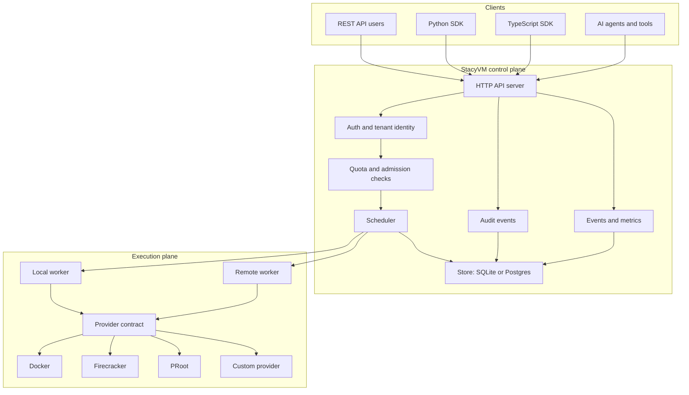
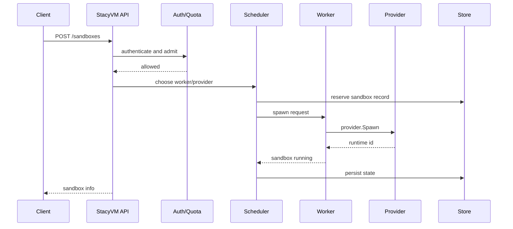
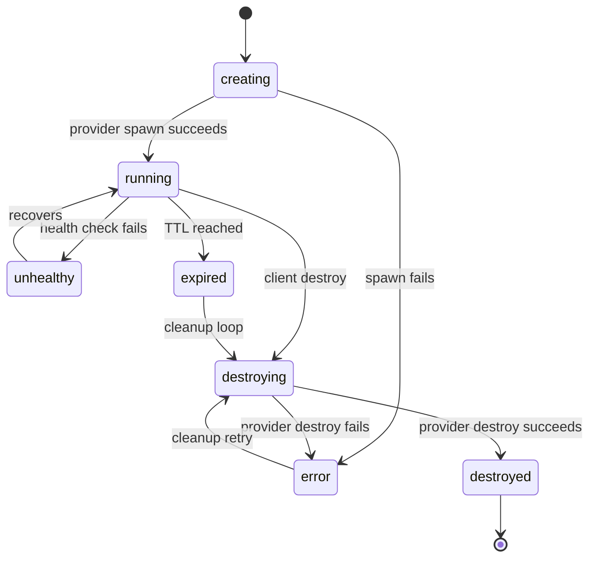
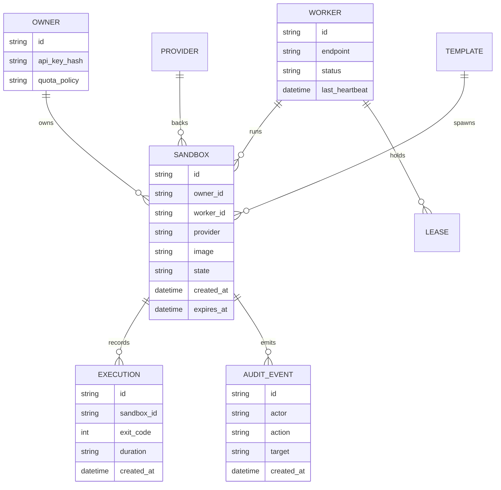
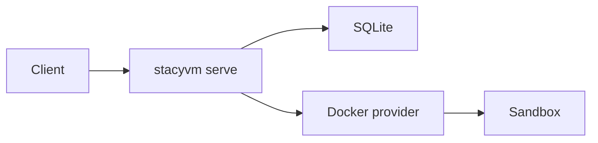
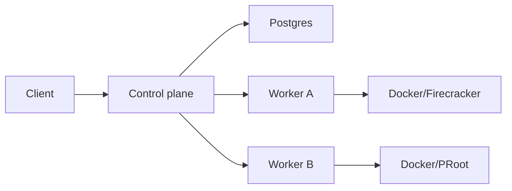

This page explains StacyVM from top to bottom. Use it when you need to understand how a request moves from an SDK call to an isolated runtime and back.

## High-Level Architecture

## Request Flow

When a client creates a sandbox, StacyVM validates identity and policy before touching a runtime provider.

## Sandbox Lifecycle

## Provider Contract

Providers implement the runtime-specific work behind a stable product API.

| Capability | Purpose |
| --- | --- |
| Spawn | Create an isolated runtime from an image or template. |
| Exec | Run a command and return exit code, stdout, stderr, and duration. |
| Stream | Send stdout/stderr chunks while a command is running. |
| Files | Write, read, list, stat, move, chmod, delete, and glob files. |
| Destroy | Tear down a sandbox safely and idempotently. |
| Health | Report provider availability and runtime readiness. |
| Logs | Expose provider and sandbox diagnostics. |

## Persistence Model

StacyVM uses a store abstraction so single-node installs can use SQLite while cluster deployments can use Postgres.

## Single-Node Mode

Single-node mode runs the API, scheduler, local worker, provider, and store in one process on one host. This is the right starting point for internal staging and technical users.

## Multi-Worker Mode

Multi-worker mode keeps the API/control plane separate from worker nodes. The scheduler assigns sandboxes to workers, and worker RPC plus leases prevent two workers from managing the same runtime.

## Operational Boundaries

- Use Docker for the broadest quickstart path.
- Use Firecracker only on hosts where KVM, kernel, rootfs, agent, networking, and snapshot behavior have passed certification.
- Use PRoot only after validating the real rootfs/bin setup on the target host.
- Use remote workers when you need horizontal capacity, runtime isolation by node class, or enterprise deployment boundaries.

## Related

- [Provider contract](/docs/provider-contract)
- [Runtime certification](/docs/runtime-certification)
- [Remote worker staging](/docs/remote-worker-staging)
- [Production readiness](/docs/production-readiness)
