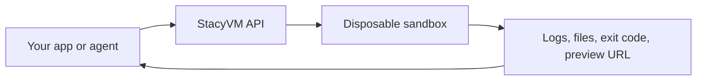
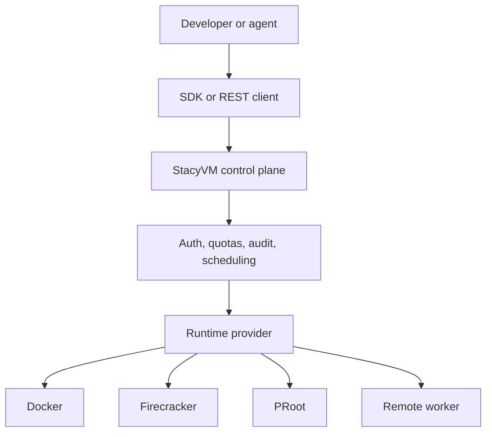

StacyVM is self-hosted sandbox infrastructure for applications that need to run code safely, repeatedly, and observably. It gives agents and developer tools a disposable machine-like workspace with shell access, files, timeouts, quotas, previews, and audit trails.

## The Short Version

Your application calls StacyVM when it needs a clean runtime. StacyVM creates a sandbox, runs work inside it, streams output back, exposes files and previews, and destroys the environment when the task is done.

## Why StacyVM Exists

AI coding agents, workflow engines, and developer tools increasingly need to execute generated code. Running that code directly on your host is risky. Outsourcing every execution to a cloud sandbox can be expensive, slower, or difficult to govern.

StacyVM sits in the middle: you keep the execution plane under your control while developers get a simple API.

## Advantages

| Advantage | What it means |
| --- | --- |
| Self-hosted control | You decide where code runs, what network it can reach, and how logs are retained. |
| Provider flexibility | Start with Docker, then certify Firecracker, PRoot, custom providers, or remote workers when needed. |
| Developer-friendly API | Use REST, Python, or TypeScript without learning the underlying runtime provider first. |
| Production guardrails | Use TTLs, quotas, typed errors, health checks, audit logs, config linting, and runtime conformance. |
| Agent-ready workflows | Run commands, stream output, move files, and expose live previews for generated web apps. |

## Common Use Cases

<CardGroup cols={2}>
  <Card title="Coding agents" icon="bot">
    Give agents a real shell and filesystem without giving them your host.
  </Card>
  <Card title="Code execution APIs" icon="square-terminal">
    Run submitted snippets, scripts, tests, and generated code in short-lived environments.
  </Card>
  <Card title="Live app previews" icon="monitor">
    Let users inspect web apps built inside sandboxes through preview URLs.
  </Card>
  <Card title="Internal automation" icon="workflow">
    Run build, migration, analysis, or validation jobs with consistent cleanup.
  </Card>
</CardGroup>

## Comparison

| Approach | Best for | Tradeoff |
| --- | --- | --- |
| Direct host execution | Trusted internal scripts | Unsafe for generated or user-provided code. |
| Docker-only wrapper | Fast local prototypes | Usually lacks a stable API, quotas, audit trails, and multi-worker routing. |
| Cloud sandbox APIs | Teams that do not want to operate infrastructure | External dependency, data egress concerns, cost, and less host-level control. |
| Kubernetes jobs | Long-running platform teams | Strong orchestration, but heavier developer ergonomics for per-agent interactive execution. |
| StacyVM | Self-hosted, agent-facing sandbox infrastructure | You operate the control plane and certify the runtimes you publicly claim. |

## Mental Model

Think of StacyVM as a control plane in front of many possible sandbox runtimes.

## What StacyVM Is Not

- It is not a promise that every provider is safe on every host. You must certify runtime claims.
- It is not a replacement for application-level authentication.
- It is not a general Kubernetes distribution.
- It is not a reason to run unbounded user code without TTLs, quotas, and audit logging.

## Next Steps

- Start with the [quickstart](/docs/getting-started/quickstart).
- Review the [system architecture](/docs/architecture/system-overview).
- Build the [Python example app](/docs/tutorials/code-runner) or [TypeScript example app](/docs/tutorials/typescript-code-runner).
